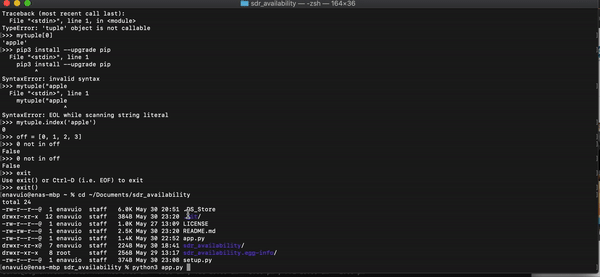

# Sales Development Representatives (SDR) Availability

## Requirements and Description

* My understanding of this project is that I should be able to understand:

```
inputs
multiple data sets and merge them  
filtering out data sets 
reading requirements clearly
```
You have been provided a ZIP file containing several directories and files. Each directory represents a Twilio office within the United States. Each file contains a list of Sales Development Representatives (SDR) and their availability for the next week.
 
Write a program that takes a time, a meeting length, and an office location. The program should return a list of SDRs that are available for a meeting
 
Assumptions:
Files only have availability for the coming week. Please assume it’s a 5 day working week.
If a day of the week is not listed, the SDR is not available.
Meetings can be either 15 or 30 minutes in length.
Don’t worry about timezone-awareness.

Original: Write a program that takes a time, a meeting length, and an office location. The program should return a list of SDRs that are available for a meeting

Write a program or piece of software. When executed it should accept a time, meeting length and office location that I would like a meeting to take place in. It should return a list of SDRs that are available to attend that meeting.

## Getting Started

### Planning and Brainstorming Board

* I have used Trello to map out my thoughts and make sure I plan out my development here. Very high level methods of breaking out the project - https://trello.com/b/nquWokrK/twilio-program.  

### Methods

* I have used Python/Pandas as my primary data analysis and manipulation.  With small files, its good, but with larger big data should primarily use Pyspark. 

### Dependencies

* Prerequisites, libraries, OS version, etc., needed before installing program.
* ex. MacOS/Linux, Python 3.6+, Pip 3

### Sample Demo 




### Installing

* After you download, cd into project run pip install ., if you have issues make sure you have python 3 because pandas is not compatible with python 2 versions. pip install . will use the setup.py file to install all packages needed

### Executing program

* Once you run pip install ., run python app.py
```
pip install .
python app.py
```

## Help

Any advise for common problems or issues.
```
If you have issues with pip install . try python3 setyp.py devel
```

## Authors


ex. Ena Vu


## Version History

* 0.1
    * Initial Release

## License

This project is licensed under the MIT License - see the LICENSE.md file for details

